# Database Schema v3 - Invunion

## Architecture des Tables - Vue d'ensemble

```mermaid
erDiagram
    %% ============================================
    %% HIERARCHY: Organization → Tenant → Data
    %% ============================================
    
    organizations ||--o{ tenants : "has many"
    organizations ||--o{ organization_members : "has many"
    
    tenants ||--o{ tenant_members : "has many"
    tenants ||--o{ bank_connections : "has many"
    tenants ||--o{ transactions : "has many"
    tenants ||--o{ invoices : "has many"
    tenants ||--o{ suppliers : "has many"
    tenants ||--o{ clients : "has many"
    tenants ||--o{ matches : "has many"
    tenants ||--o{ alerts : "has many"
    tenants ||--o{ reports : "has many"
    tenants ||--o{ import_jobs : "has many"
    
    users ||--o{ organization_members : "member of"
    users ||--o{ tenant_members : "member of"
    users ||--o{ matches : "created by"
    users ||--o{ alerts : "assigned to"
    users ||--o{ import_jobs : "created by"
    users ||--o{ audit_log : "performed action"
    
    %% ============================================
    %% BANKING LAYER
    %% ============================================
    
    bank_connections ||--o{ bank_accounts : "has many"
    bank_accounts ||--o{ transactions : "source of"
    
    %% ============================================
    %% BUSINESS ENTITIES
    %% ============================================
    
    suppliers ||--o{ invoices : "received from"
    suppliers ||--o{ transactions : "paid to"
    
    clients ||--o{ invoices : "issued to"
    clients ||--o{ transactions : "paid by"
    
    %% ============================================
    %% INVOICE PROVIDERS
    %% ============================================
    
    invoice_providers ||--o{ invoices : "synced from"
    
    %% ============================================
    %% MATCHING LAYER
    %% ============================================
    
    transactions ||--o{ matches : "matched in"
    invoices ||--o{ matches : "matched in"
    crypto_transactions ||--o{ matches : "matched in"
    
    matches ||--o{ alerts : "triggers"
    invoices ||--o{ alerts : "related to"
    
    %% ============================================
    %% WEBHOOKS & AUDIT
    %% ============================================
    
    webhook_events }o--|| tenants : "received by"
    audit_log }o--|| tenants : "logged for"
    
    %% ============================================
    %% TABLE DEFINITIONS
    %% ============================================
    
    organizations {
        uuid id PK
        string name
        string slug UK "URL-friendly"
        string plan "starter/pro/enterprise"
        string billing_email
        int max_tenants
        int max_users
        jsonb settings
        string status "active/suspended/cancelled"
        timestamptz created_at
        timestamptz updated_at
    }
    
    tenants {
        uuid id PK
        uuid organization_id FK "NEW"
        string name
        string legal_name "NEW"
        string tax_id "NEW - SIRET/VAT"
        string country "NEW - ISO 3166"
        string timezone "NEW"
        string plan
        string status
        jsonb metadata
        timestamptz created_at
        timestamptz updated_at
    }
    
    users {
        uuid id PK
        uuid tenant_id FK "legacy"
        string firebase_uid UK
        string email
        string first_name
        string last_name
        string role "legacy"
        jsonb metadata
        timestamptz created_at
        timestamptz updated_at
    }
    
    organization_members {
        uuid id PK
        uuid organization_id FK
        uuid user_id FK
        string role "owner/admin/member"
        timestamptz created_at
    }
    
    tenant_members {
        uuid id PK
        uuid tenant_id FK
        uuid user_id FK
        string role "admin/editor/viewer"
        timestamptz created_at
    }
    
    clients {
        uuid id PK
        uuid tenant_id FK
        string client_organization_id "External ID"
        string client_entity_id "External ID"
        string client_service_id "Department"
        string label
        string recipient_name
        string vat_number
        string category "individual/professional/governmental"
        string email_contact
        string phone_contact
        text address
        string country
        string external_reference
        string internal_reference
        decimal payment_score "0-100 AUTO"
        int avg_payment_days "AUTO"
        decimal total_invoiced "AUTO"
        decimal total_paid "AUTO"
        date last_invoice_date "AUTO"
        date last_payment_date "AUTO"
        int invoice_count "AUTO"
        string status "active/inactive/blocked/prospect"
        jsonb metadata
        timestamptz created_at
        timestamptz updated_at
    }
    
    suppliers {
        uuid id PK
        uuid tenant_id FK
        string name
        string email
        string phone
        text address
        string tax_id
        string iban
        string bic
        int payment_terms_days
        string status "active/inactive"
        jsonb metadata
        timestamptz created_at
        timestamptz updated_at
    }
    
    bank_connections {
        uuid id PK
        uuid tenant_id FK
        uuid user_id FK
        string provider "tink/gocardless/salt_edge/plaid"
        string provider_connection_id
        string provider_user_id
        string status "pending/active/expired/error"
        timestamptz access_expires_at "PSD2 90 days"
        timestamptz last_sync_at
        text last_sync_error
        jsonb metadata
        timestamptz created_at
        timestamptz updated_at
    }
    
    bank_accounts {
        uuid id PK
        uuid connection_id FK
        uuid tenant_id FK
        string provider
        string provider_account_id
        string name
        string iban
        string bic
        string currency
        string account_type
        decimal balance
        timestamptz balance_updated_at
        string bank_name
        text bank_logo_url
        string status
        timestamptz last_sync_at
        jsonb metadata
        timestamptz created_at
        timestamptz updated_at
    }
    
    transactions {
        uuid id PK
        uuid tenant_id FK
        uuid account_id FK
        uuid supplier_id FK
        uuid client_id FK "NEW"
        string source_type "tink/gocardless/csv/api/manual/n8n"
        string source_id UK
        jsonb source_raw
        decimal amount
        string currency
        date transaction_date
        date booking_date
        date value_date
        timestamptz added_at
        string payment_method
        string payment_context
        string external_reference
        text description_original
        text description_display
        string category
        string counterparty_name
        string counterparty_iban
        string counterparty_bic
        string status "unconsidered/unmatched/matched/ignored/pending"
        jsonb metadata
        timestamptz created_at
        timestamptz updated_at
    }
    
    crypto_transactions {
        uuid id PK
        uuid tenant_id FK
        string wallet_address
        string chain
        string provider
        string tx_hash UK
        decimal amount
        string token_symbol
        string token_address
        string from_address
        string to_address
        timestamptz transaction_date
        decimal gas_used
        decimal gas_price
        string status "unmatched/matched/ignored"
        jsonb raw_data
        jsonb metadata
        timestamptz created_at
    }
    
    invoice_providers {
        uuid id PK
        uuid tenant_id FK
        string provider "pennylane/stripe/quickbooks/xero"
        string api_key_ref
        string webhook_secret_ref
        string status
        timestamptz last_sync_at
        jsonb metadata
        timestamptz created_at
    }
    
    invoices {
        uuid id PK
        uuid tenant_id FK
        uuid provider_id FK
        uuid supplier_id FK "For received invoices"
        uuid client_id FK "NEW - For issued invoices"
        string source_type
        string source_id UK
        jsonb source_raw
        string invoice_number
        string external_reference
        date invoice_date
        date due_date
        date payment_expected_date
        decimal amount_excl_vat
        decimal vat_amount
        decimal amount_incl_vat
        string currency
        string payment_method
        string recipient_name
        string customer_name "legacy"
        string customer_email
        string email_contact
        string phone_contact
        text description
        string invoice_type "issued/received"
        decimal recovery_percent "0-100 AUTO"
        string status "unpaid/partial/paid/cancelled/overdue"
        jsonb metadata
        timestamptz created_at
        timestamptz updated_at
    }
    
    matches {
        uuid id PK
        uuid tenant_id FK
        uuid transaction_id FK
        string transaction_type "bank/crypto"
        uuid crypto_transaction_id FK
        uuid invoice_id FK
        decimal matched_amount "Partial OK"
        string match_type "ai_auto/manual/rule/n8n"
        decimal confidence_score "0-100"
        text ai_reasoning
        uuid matched_by FK
        string status "active/cancelled"
        jsonb metadata
        timestamptz created_at
    }
    
    alerts {
        uuid id PK
        uuid tenant_id FK
        uuid user_id FK
        string alert_type "new_match/low_confidence/anomaly/sync_error/overdue_invoice"
        string title
        text message
        uuid related_match_id FK
        uuid related_invoice_id FK
        string status "unread/read/dismissed"
        boolean notification_sent
        jsonb metadata
        timestamptz created_at
    }
    
    reports {
        uuid id PK
        uuid tenant_id FK
        string report_type
        date period_start
        date period_end
        jsonb data
        jsonb metadata
        timestamptz generated_at
    }
    
    import_jobs {
        uuid id PK
        uuid tenant_id FK
        uuid user_id FK
        string file_name
        string file_type "transactions/invoices"
        string file_format "csv/json"
        int total_rows
        int processed_rows
        int error_rows
        jsonb errors
        string status "pending/processing/completed/failed"
        timestamptz started_at
        timestamptz completed_at
        jsonb metadata
        timestamptz created_at
    }
    
    webhook_events {
        uuid id PK
        string event_id UK
        string provider
        timestamptz received_at
        boolean processed
        jsonb payload
        jsonb metadata
    }
    
    audit_log {
        bigserial id PK
        uuid tenant_id FK
        uuid user_id FK
        string action
        string resource_type
        uuid resource_id
        jsonb old_values
        jsonb new_values
        inet ip_address
        jsonb metadata
        timestamptz created_at
    }
```



---

## 🔑 Légende des Relations

### Hiérarchie Principale (3 niveaux)
```
Organization (Mère)
    ├── Tenant 1 (Filiale FR)
    │   ├── Transactions
    │   ├── Invoices
    │   ├── Clients
    │   └── Suppliers
    ├── Tenant 2 (Filiale DE)
    │   ├── Transactions
    │   ├── Invoices
    │   ├── Clients
    │   └── Suppliers
    └── Tenant 3 (Filiale ES)
        └── ...
```

### Flux de Données

#### 1️⃣ **Factures ÉMISES** (Vous → Client)
```
Client → Invoice (issued) → Match → Transaction (incoming payment)
                                        ↓
                            Auto-calcul: payment_score, avg_payment_days
```

#### 2️⃣ **Factures REÇUES** (Fournisseur → Vous)
```
Supplier → Invoice (received) → Match → Transaction (outgoing payment)
                                            ↓
                                Auto-calcul: recovery_percent
```

#### 3️⃣ **Connexions Bancaires**
```
Bank Connection → Bank Account → Transactions
                                      ↓
                                  Matching Engine
```

#### 4️⃣ **Permissions Multi-niveaux**
```
User → Organization Member (owner/admin/member)
    → Tenant Member (admin/editor/viewer)
        → Access to Tenant Data
```

---

## 📊 Tables par Catégorie

### 🏢 **Hiérarchie & Permissions** (5 tables)
- `organizations` - Organisation mère
- `tenants` - Entités/filiales
- `users` - Utilisateurs
- `organization_members` - Membres d'organisation
- `tenant_members` - Membres de tenant

### 💼 **Entités Métier** (2 tables)
- `clients` - Ceux qui vous paient (NOUVEAU)
- `suppliers` - Ceux que vous payez

### 🏦 **Banking** (3 tables)
- `bank_connections` - Connexions bancaires
- `bank_accounts` - Comptes bancaires
- `transactions` - Transactions bancaires

### 📄 **Facturation** (2 tables)
- `invoice_providers` - Providers de facturation
- `invoices` - Factures émises/reçues

### 🤝 **Rapprochement** (2 tables)
- `matches` - Rapprochements transaction ↔ facture
- `crypto_transactions` - Transactions crypto (futur)

### 🔔 **Notifications & Reporting** (3 tables)
- `alerts` - Alertes
- `reports` - Rapports (cache)
- `import_jobs` - Jobs d'import CSV

### 🔐 **Audit & Webhooks** (2 tables)
- `webhook_events` - Événements webhook
- `audit_log` - Journal d'audit

---

## 🆕 Nouveautés Architecture v3

### ✅ Tables Nouvelles
1. **organizations** - Organisation mère (multi-tenant)
2. **organization_members** - RBAC niveau organisation
3. **tenant_members** - RBAC niveau tenant
4. **clients** - Gestion des clients + analytics de paiement

### ✏️ Tables Modifiées
1. **tenants** - Ajout de `organization_id`, `legal_name`, `tax_id`, `country`, `timezone`
2. **transactions** - Ajout de `client_id` (lien vers clients)
3. **invoices** - Ajout de `client_id` (lien vers clients)

### 🔄 Auto-Calculated Fields

#### Sur `clients` (via trigger `update_client_payment_analytics`)
- `payment_score` - Score 0-100% basé sur total_paid / total_invoiced
- `avg_payment_days` - Délai moyen entre invoice_date et transaction_date
- `total_invoiced` - Somme des factures émises
- `total_paid` - Somme des paiements reçus
- `last_invoice_date` - Date de dernière facture
- `last_payment_date` - Date de dernier paiement
- `invoice_count` - Nombre de factures

#### Sur `invoices` (via trigger `update_invoice_recovery`)
- `recovery_percent` - % de la facture couverte par les matches
- `status` - Mis à jour automatiquement (unpaid/partial/paid)

---

## 🔍 Index Clés pour Performance

### Indexes de Recherche Rapide
```sql
-- Matching queries (AI + Manual)
CREATE INDEX idx_transactions_matching ON transactions(tenant_id, status, transaction_date, amount);
CREATE INDEX idx_invoices_matching ON invoices(tenant_id, status, invoice_type, amount_incl_vat);

-- Client analytics
CREATE INDEX idx_clients_payment_score ON clients(tenant_id, payment_score);
CREATE INDEX idx_clients_category ON clients(tenant_id, category);

-- Multi-tenant isolation
CREATE INDEX idx_transactions_tenant ON transactions(tenant_id);
CREATE INDEX idx_invoices_tenant ON invoices(tenant_id);
CREATE INDEX idx_clients_tenant ON clients(tenant_id);
```

---

## 🚀 Prêt pour Milestone 4

Ce schéma représente l'état final après la migration `003_architecture_v3.sql`.

**Prochaines étapes:**
1. Créer le fichier de migration SQL
2. Implémenter les triggers auto-calculés
3. Migrer les données existantes
4. Créer les endpoints API pour organizations et clients
5. Mettre à jour le frontend avec le sélecteur de tenant

---

**Document créé:** 13 février 2026  
**Version:** 3.0
