# Diagramme d'Architecture - Flux de Données

## Vue d'ensemble du système

```mermaid
graph LR
    %% Styles
    classDef external fill:#f9f,stroke:#333,stroke-width:2px;
    classDef ingestion fill:#ffcc00,stroke:#333,stroke-width:2px;
    classDef storage fill:#3399ff,stroke:#333,stroke-width:2px,color:white;
    classDef process fill:#9933ff,stroke:#333,stroke-width:2px,color:white;
    classDef userzone fill:#00cc66,stroke:#333,stroke-width:2px,color:white;

    %% Acteurs Externes
    subgraph External["🌍 Sources Externes"]
        Tink[("🏦 Tink (Banques)")]:::external
        ERP[("📊 ERP\n(Factures)")]:::external
        Webhooks[("📨 Webhooks\n(Providers)")]:::external
        ExternalClients[("🔌 API Clients\n(CSV/JSON Upload)")]:::external
    end

    %% ZONE 1 : INGESTION (Le Bouclier)
    subgraph ZoneIngestion["🛡️ Zone Ingestion (Async)"]
        n8n["🐙 n8n\n(Orchestrator)"]:::ingestion
        CoreWebhook["🔔 Cloud Run\n(Service: Core Webhook)"]:::ingestion
        PubSubIngest[("📨 Google Pub/Sub\n(Topic: ingest)")]:::ingestion
        IngestWorker["⚙️ Cloud Run\n(Service: Ingest Worker)"]:::ingestion
    end

    %% ZONE 2 : DATA (Le Coeur)
    subgraph ZoneData["💾 Zone Données (Master)"]
        CloudSQL[("🛢️ Cloud SQL\n(PostgreSQL)\nMultiple Tables")]:::storage
    end

    %% ZONE 3 : TRAITEMENT (Le Cerveau)
    subgraph ZoneProcess["🧠 Zone Traitement (Worker)"]
        ProcessWorker["⚙️ Cloud Run\n(Service: Worker/Jobs)"]:::process
        IAMatch["🤖 IA Matching\n(Vertex AI)"]:::process
        PubSubProcess[("📨 Google Pub/Sub\n(Topic: process)")]:::process
    end

    %% ZONE 4 : UTILISATEUR (La Façade)
    subgraph ZoneUser["👤 Zone Utilisateur (API-First)"]
        CoreAPI["🚀 Cloud Run\n(Service: Core API)\nREST/GraphQL"]:::userzone
        Frontend["💻 Frontend\n(Lovable/React)"]:::userzone
    end

    %% FLUX DE DONNEES
    %% Flux Banques via n8n
    Tink -- "1. JSON Data" --> n8n
    
    %% Flux ERP Factures via n8n
    ERP -- "2. Factures Data" --> n8n
    
    %% Consolidation n8n vers Pub/Sub
    n8n -- "3. Push Message" --> PubSubIngest
    
    %% Flux Webhooks
    Webhooks -- "Webhook Events" --> CoreWebhook
    CoreWebhook -- "Validate & Push" --> PubSubIngest
    
    %% Flux Ingestion vers Data
    PubSubIngest -- "4. Dépile (Batch)" --> IngestWorker
    IngestWorker -- "5. INSERT (Bulk)" --> CloudSQL

    %% Flux Traitement (après ingestion complète)
    CloudSQL -- "6. Trigger\n(Data Ready)" --> PubSubProcess
    PubSubProcess -- "7. Dépile" --> ProcessWorker
    ProcessWorker -- "8. Lit (Unmatched)" --> CloudSQL
    ProcessWorker -- "9. Appelle IA" --> IAMatch
    IAMatch -- "10. Résultats" --> ProcessWorker
    ProcessWorker -- "11. UPDATE (Matches)" --> CloudSQL

    %% Flux Emails/Alertes
    CloudSQL -- "Events" --> CoreAPI
    CoreAPI -- "Read Alerts Queue" --> CloudSQL

    %% Flux Upload CSV/JSON
    ExternalClients -- "Upload CSV/JSON" --> CoreAPI
    CoreAPI -- "Parse & Validate" --> PubSubIngest
    
    %% Flux Utilisateur
    Frontend -- "HTTPS / GraphQL" --> CoreAPI
    ExternalClients -- "API Calls" --> CoreAPI
    CoreAPI -- "SELECT (Read)" --> CloudSQL
    CoreAPI -- "CRUD Operations" --> CloudSQL
```



## Micro-services Cloud Run

- **Core API** : API principale **API-First** (REST/GraphQL) pour :
  - Requêtes utilisateur (CRUD)
  - Upload de fichiers CSV/JSON
  - Gestion des emails/alertes
  - Point d'entrée pour tous les clients (Frontend + API externes)
- **Core Webhook** : Service dédié à la réception et validation des webhooks externes
- **Ingest Worker** : Service d'ingestion qui écrit les données dans Cloud SQL (toutes sources confondues)
- **Worker/Jobs** : Service de traitement qui orchestre l'IA après ingestion complète (à venir)

## Légende des Zones

- **🛡️ Zone Ingestion (Async)** : Point d'entrée asynchrone pour toutes les données externes (n8n, Core Webhook, Ingest Worker)
- **💾 Zone Données (Master)** : Source de vérité, stockage principal des données (Cloud SQL PostgreSQL avec plusieurs tables - voir ci-dessous)
- **🧠 Zone Traitement (Worker)** : Traitement asynchrone des données - L'IA intervient UNIQUEMENT après que toutes les données soient dans Cloud SQL (à venir)
- **👤 Zone Utilisateur (API-First)** : API principale (Core API) accessible par le Frontend ET par des clients externes + gestion des emails/alertes

## Tables principales dans Cloud SQL

Cloud SQL (PostgreSQL) contient plusieurs tables organisées par domaine :

### Tables Bancaires
- **bank_connections** : Connexions aux providers bancaires (Tink, etc.)
- **bank_accounts** : Comptes bancaires liés aux connexions
- **transactions** : Transactions bancaires (ou `transactions_unified` selon l'architecture)

### Tables Factures/ERP
- **invoices** / **factures** : Factures provenant de l'ERP
- **external_data** : Données externes (si architecture multi-sources)

### Tables Relations/Matching
- **data_relationships** : Relations entre transactions et factures (matching IA)
- **reconciliation_matches** : Résultats de réconciliation

### Tables Système
- **emails_queue** / **alerts_queue** : Queue d'emails et alertes à envoyer
- **data_ingestion_log** : Logs d'ingestion pour traçabilité
- **import_jobs** : Suivi des imports CSV/JSON (statut, erreurs, etc.)
- **users**, **tenants** : Gestion des utilisateurs et organisations (si nécessaire)

## Types de Composants

- **Sources Externes** (Rose) : Sources de données externes (Tink, ERP, Webhooks providers)
- **Ingestion** (Jaune) : Services d'ingestion et orchestration (n8n, Core Webhook, Ingest Worker, Pub/Sub)
- **Stockage** (Bleu) : Base de données principale (Cloud SQL PostgreSQL - plusieurs tables pour transactions, factures, connexions, emails/alertes, etc.)
- **Traitement** (Violet) : Services de traitement et IA (Worker/Jobs, Vertex AI, Pub/Sub) - à venir
- **Utilisateur** (Vert) : API et interface utilisateur (Core API, Frontend)

## Flux de Données

1. **Ingestion Banques** : Tink → n8n → Pub/Sub → Ingest Worker → Cloud SQL
2. **Ingestion Factures ERP** : ERP → n8n → Pub/Sub → Ingest Worker → Cloud SQL
3. **Webhooks** : Providers → Core Webhook → Pub/Sub → Ingest Worker → Cloud SQL
4. **Upload CSV/JSON** : Clients externes → Core API (upload/parse) → Pub/Sub → Ingest Worker → Cloud SQL
5. **Traitement IA** : Cloud SQL (toutes données ingérées) → Pub/Sub → Worker/Jobs → Vertex AI → Cloud SQL (résultats) - à venir
6. **Emails/Alertes** : Cloud SQL (queue d'alertes) → Core API → Envoi emails/notifications
7. **Lecture/Écriture Utilisateur** : Frontend/API Clients → Core API → Cloud SQL (CRUD)

## À propos des Webhooks

**À quoi servent les Webhook Events ?**

Les webhooks sont des notifications en temps réel envoyées par des providers externes (comme Tink, ou d'autres services) pour signaler des événements importants :

- **Nouvelles transactions** : Tink peut envoyer un webhook quand une nouvelle transaction apparaît sur un compte connecté
- **Changements de statut** : Notifications de changements (compte déconnecté, token expiré, etc.)
- **Événements métier** : D'autres services peuvent notifier des événements importants pour votre système

Le service **Core Webhook** reçoit ces webhooks, les valide (sécurité, authentification), puis les envoie dans Pub/Sub pour traitement asynchrone par l'Ingest Worker. Cela permet une réaction en temps réel aux événements externes sans polling continu.

---

## Architecture API-First

### Principe
L'application suit une architecture **API-First** : **Core API** est le point d'entrée unique pour tous les clients (Frontend, clients externes, intégrations).

### Avantages
- ✅ **Réutilisabilité** : L'API peut être utilisée par différents clients (web, mobile, intégrations)
- ✅ **Découplage** : Le Frontend et les autres clients sont indépendants
- ✅ **Évolutivité** : Facile d'ajouter de nouveaux clients sans modifier le backend
- ✅ **Documentation** : API documentée (OpenAPI/Swagger) pour faciliter l'intégration

### Endpoints Principaux de Core API

#### 1. CRUD Standard
- `GET /api/transactions` - Liste des transactions
- `GET /api/transactions/:id` - Détail d'une transaction
- `POST /api/transactions` - Créer une transaction
- `PUT /api/transactions/:id` - Mettre à jour
- `DELETE /api/transactions/:id` - Supprimer

#### 2. Upload de Fichiers CSV/JSON
- `POST /api/ingest/upload` - Upload CSV/JSON
  - Accepte : `multipart/form-data` (fichier) ou JSON (données directes)
  - Formats supportés : CSV, JSON
  - Validation automatique
  - Parsing et normalisation
  - Envoi dans Pub/Sub pour traitement asynchrone

#### 3. Export de Données
- `GET /api/export/transactions` - Export CSV/JSON
- `GET /api/export/factures` - Export factures

### Authentification
- **Firebase Auth** pour le Frontend (JWT tokens)
- **API Keys** ou **OAuth2** pour les clients externes
- Chaque requête authentifiée avec `tenant_id` pour isolation multi-tenant

---

## Import CSV/JSON - Implémentation

### Flow d'Import

1. **Upload** : Client envoie fichier CSV/JSON à `POST /api/ingest/upload`
2. **Validation** : Core API valide le format et le schéma
3. **Parsing** : Extraction et normalisation des données
4. **Queue** : Envoi dans Pub/Sub (Topic: ingest)
5. **Traitement** : Ingest Worker traite de manière asynchrone
6. **Stockage** : Écriture dans Cloud SQL
7. **Réponse** : Statut de l'upload retourné au client

### Format CSV Attendu

```csv
date,amount,description,category,merchant
2024-01-15,125.50,Restaurant Le Paris,category_restaurant,Le Paris
2024-01-16,29.99,Netflix Subscription,category_subscription,Netflix
```

### Format JSON Attendu

```json
{
  "transactions": [
    {
      "date": "2024-01-15",
      "amount": 125.50,
      "currency": "EUR",
      "description": "Restaurant Le Paris",
      "category": "category_restaurant",
      "merchant": "Le Paris"
    }
  ]
}
```

### Modifications Techniques Nécessaires

#### 1. Core API - Nouveau Endpoint
```javascript
// src/routes/ingest.js
router.post('/upload', requireAuth, upload.single('file'), async (req, res) => {
  const file = req.file; // CSV ou JSON
  const tenantId = req.user.tenantId;
  
  // Parse le fichier
  const data = await parseFile(file);
  
  // Valider le schéma
  const validated = await validateData(data);
  
  // Publier dans Pub/Sub
  await publishToPubSub('ingest', {
    tenantId,
    source: 'api_upload',
    data: validated,
    uploadedBy: req.user.uid
  });
  
  res.json({ 
    status: 'queued',
    recordsCount: validated.length,
    jobId: jobId
  });
});
```

#### 2. Service de Parsing
- **CSV** : Utiliser `csv-parse` ou `papaparse`
- **JSON** : Parsing natif + validation JSON Schema
- **Normalisation** : Adapter au format interne

#### 3. Validation
- **JSON Schema** pour valider la structure
- **Business Rules** (montants valides, dates, etc.)
- **Limites** : Taille max fichier, nombre de lignes

#### 4. Monitoring
- Table `import_jobs` dans Cloud SQL pour tracker les imports
- Statut : `pending`, `processing`, `completed`, `failed`
- Logs d'erreurs détaillés

### Tables Nécessaires (ajout)

```sql
-- Table pour tracker les imports
CREATE TABLE import_jobs (
    id UUID PRIMARY KEY DEFAULT gen_random_uuid(),
    tenant_id UUID NOT NULL,
    user_id UUID NOT NULL,
    source_type VARCHAR(50) DEFAULT 'api_upload',
    file_name VARCHAR(255),
    file_type VARCHAR(10), -- 'csv', 'json'
    status VARCHAR(20) DEFAULT 'pending', -- 'pending', 'processing', 'completed', 'failed'
    records_count INTEGER,
    records_processed INTEGER DEFAULT 0,
    errors JSONB,
    created_at TIMESTAMP DEFAULT NOW(),
    completed_at TIMESTAMP
);

CREATE INDEX idx_import_jobs_tenant ON import_jobs(tenant_id);
CREATE INDEX idx_import_jobs_status ON import_jobs(status);
```
